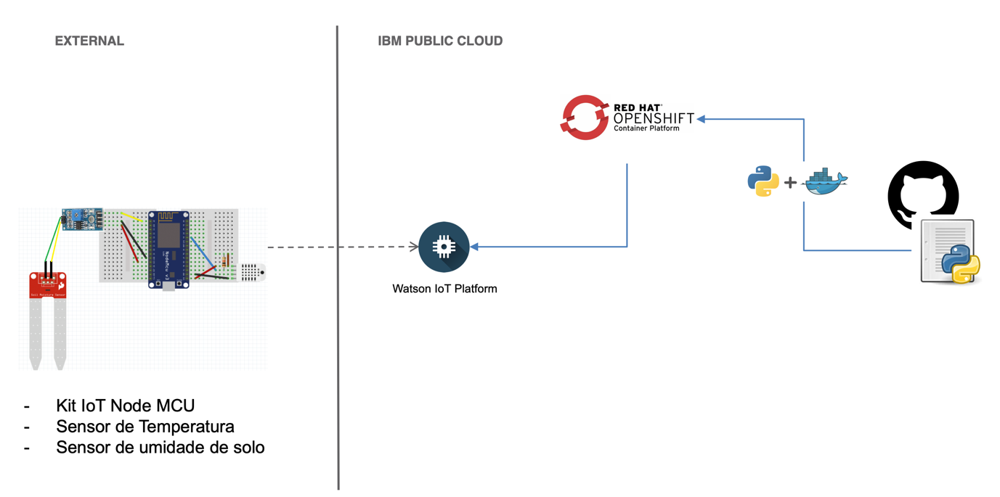
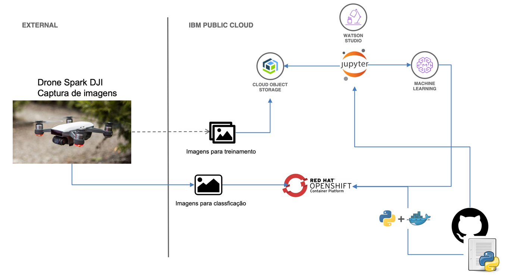

# Desafio 09 | Banco do Brasil

- [Desafio 09 | Banco do Brasil](#desafio-09--banco-do-brasil)
  - [1 - Introdução](#1---introdu%c3%a7%c3%a3o)
  - [2 - Desafio](#2---desafio)

## 1 - Introdução
O Banco do Brasil, maior banco da América Latina, com destaque em segmentos como agronegócio, infraestrutura, micro e pequenas empresas.
O seu maior propósito é estar próximo das pessoas e ajudar a preservar o que é importante para seus clientes, acionistas, funcionários e toda a sociedade.
Por esta razão, pensando no pequeno e médio agricultor, que muitas vezes não tem acesso, desconhece ou não tem capacidade financeira para contratar soluções robustas que os auxiliem na gestão e monitoramento de seus processos produtivos, o Banco do Brasil quer desenvolver solução de baixo custo, para que estes proprietários através do controle de temperatura e umidade do solo, possam planejar melhor sistemas de irrigação baseado no tipo do produto, além de sistema de reconhecimento de pragas e qualidade do plantio através de processamento de imagens capturadas com drones.

## 2 - Desafio
Nesta solução deverá ser usado, kit com microcontrolador com sensor de temperatura ambiente e umidade do solo, MQTT para integração e gerenciamento dos sensores / devices, container utilizando Docker para hospedar programa de gerenciamento e controle, desenvolvido em Python com Flask, Google Colaboratory para desenvolvimento de modelos de aprendizado de máquina profundo, utilizando Jupyter Notebook e Python.

    
    
Imagem 1: Arquitetura IOT.

    
    
Imagem 2: Arquitetura AI.

 
 
 